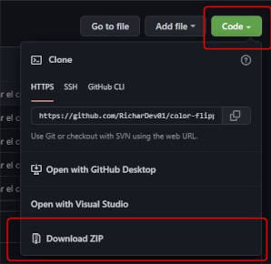

# CAROUSEL REVIEWS

En este proyecto, realice un componente ***Carousel reviews*** que me permite cambiar el contenido de un recuadro al apretar los botones de flecha, ademas de agregar el boton que aleatoriamente colocara una informacion o otra, de la base de datos que tenga el programa.

## LA FUNCIONANLIDAD
El contenido del recuadro blanco, que seria el *carousel*, mostrara las distintas *reviews* que tenga el programa, la cual se encontraran en formato de objetos de javascript dentro del mismo archivo.

Hay tres botones *fechas* que me indicaran avanzar o retroceder al un contenido en concreto,  y el boton *surprise me* que mostrara aleatoriamente un contenido almacenado en el archivo js.

## DESCARGAR PROYECTO
Da click, en la parte superior derecha de este repositorio, al boton verde llamado *code*
Al tener abierto el dropdown, a la parte inferior, preciona el boton *Download ZIP*
Descomprime el archivo y haz doble click al archivo index.html.

Y eso es todo, ya deberia poder ver el proyecto ***Carousel reviews***

## TECNOLOGIAS USADAS

- HTML
- CSS
- JavaScript